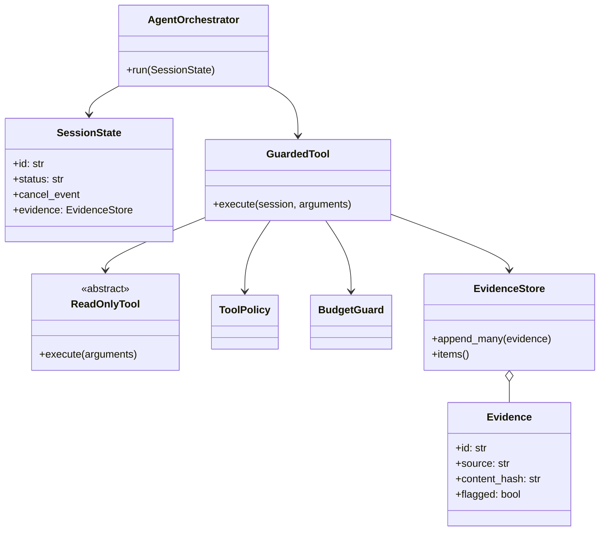

# Class diagram

```mermaid
classDiagram
  class AgentOrchestrator {
    +run(SessionState)
  }
  class SessionState {
    +id: str
    +status: str
    +cancel_event
    +evidence: EvidenceStore
  }
  class ReadOnlyTool {
    <<abstract>>
    +execute(arguments)
  }
  class GuardedTool {
    +execute(session, arguments)
  }
  class ToolPolicy
  class BudgetGuard
  class Evidence {
    +id: str
    +source: str
    +content_hash: str
    +flagged: bool
  }
  class EvidenceStore {
    +append_many(evidence)
    +items()
  }
  AgentOrchestrator --> SessionState
  AgentOrchestrator --> GuardedTool
  GuardedTool --> ReadOnlyTool
  GuardedTool --> ToolPolicy
  GuardedTool --> BudgetGuard
  GuardedTool --> EvidenceStore
  EvidenceStore o-- Evidence
```
