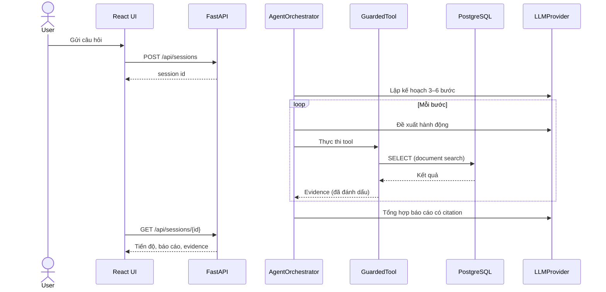

# Sequence diagram

```mermaid
sequenceDiagram
  actor User
  participant UI as React UI
  participant API as FastAPI
  participant Agent as AgentOrchestrator
  participant Guard as GuardedTool
  participant DB as PostgreSQL
  participant LLM as LLMProvider
  User->>UI: Gửi câu hỏi
  UI->>API: POST /api/sessions
  API-->>UI: session id
  Agent->>LLM: Lập kế hoạch 3–6 bước
  loop Mỗi bước
    Agent->>LLM: Đề xuất hành động
    Agent->>Guard: Thực thi tool
    Guard->>DB: SELECT (document search)
    DB-->>Guard: Kết quả
    Guard-->>Agent: Evidence (đã đánh dấu)
  end
  Agent->>LLM: Tổng hợp báo cáo có citation
  UI->>API: GET /api/sessions/{id}
  API-->>UI: Tiến độ, báo cáo, evidence
```
