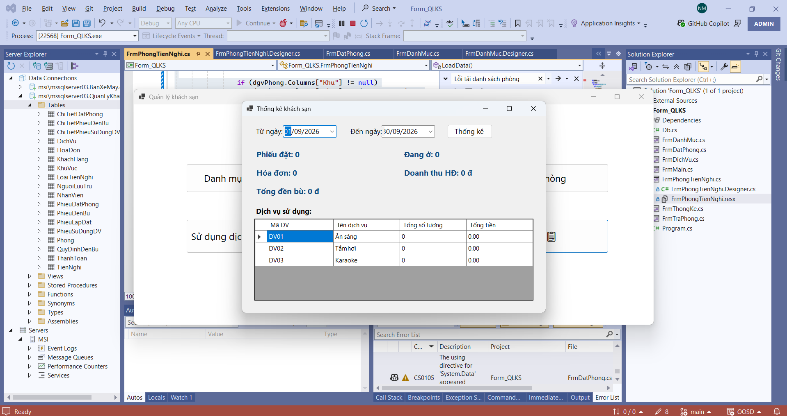
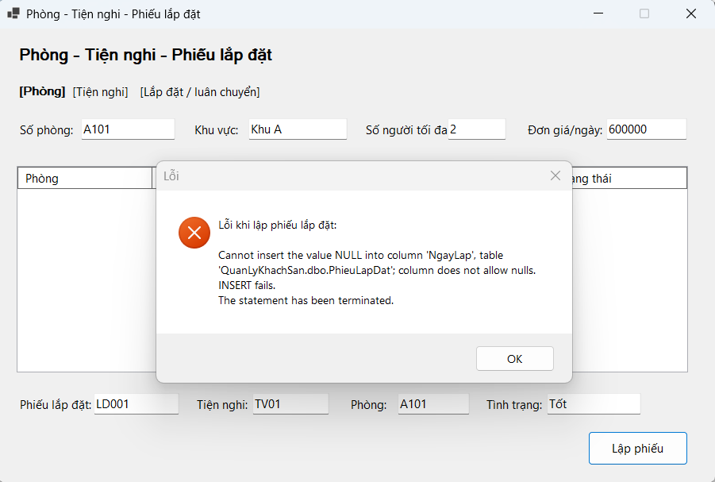

# BÁO CÁO KẾT QUẢ LAB 3

## 1. Thông tin sinh viên

- **Họ và tên:** Huỳnh Đại Lục
- **Mã số sinh viên (MSSV):** 1250080109
- **Lớp:** 12_ĐH_CNPM2

## 2. Thông tin bài Lab

- **Tên bài Lab:** LAB 3 - Quản lý Khách sạn
- **Ngày hoàn thành:** 25/09/2026

## 3. Môi trường & Phiên bản (Environment)

- **Hệ điều hành:** Windows 11
- **Ngôn ngữ lập trình:** C#
- **Framework / Thư viện:** .NET 9
- **Công cụ / IDE:** Visual Studio Code 2022

## 4. Nội dung đã thực hiện

- **Yêu cầu 1:** Tạo file word lưu bằng chứng
- **Yêu cầu 2:** Tạo file Readme.md
- **Yêu cầu 3:** commit các file source code bên Visual studio code

## 5. Kết quả đạt được

- **Mô tả ngắn:** Chỉ chạy được giao diện có kết nối csdl , chưa viết xong code xử lí ghi dữ liệu vào csdl
- **Hình ảnh minh họa:**
  
  

## 6. Lỗi gặp phải & Cách khắc phục

| STT | Lỗi gặp phải           | Nguyên nhân                                 | Cách khắc phục                       |
| :-: | :--------------------- | :------------------------------------------ | :----------------------------------- |
|  1  | `Chưa đặt được phòng'` | Chưa hiện phòng để chọn vì viết sai cú pháp | sửa code vào FrmDatPhongDesigner.cs` |
|  2  | `...`                  | ...                                         | ...                                  |
